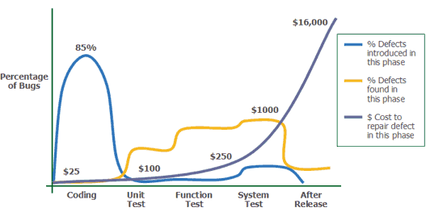
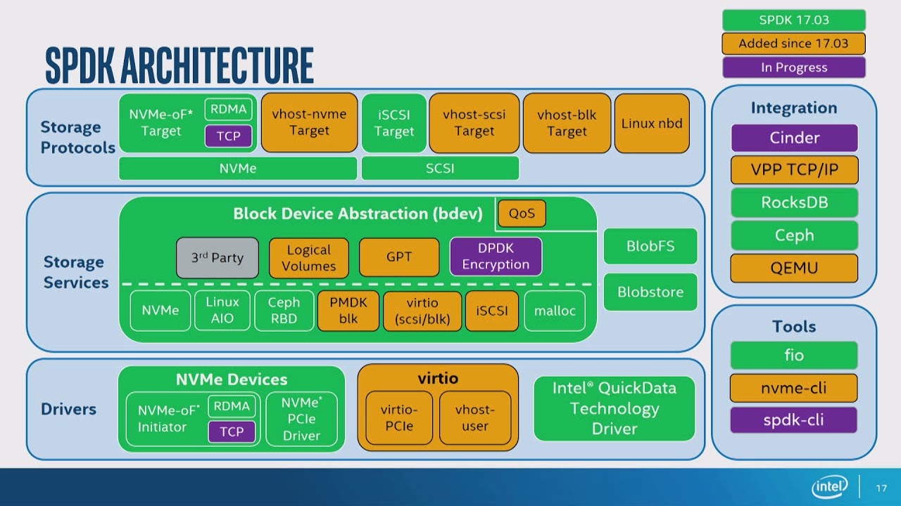
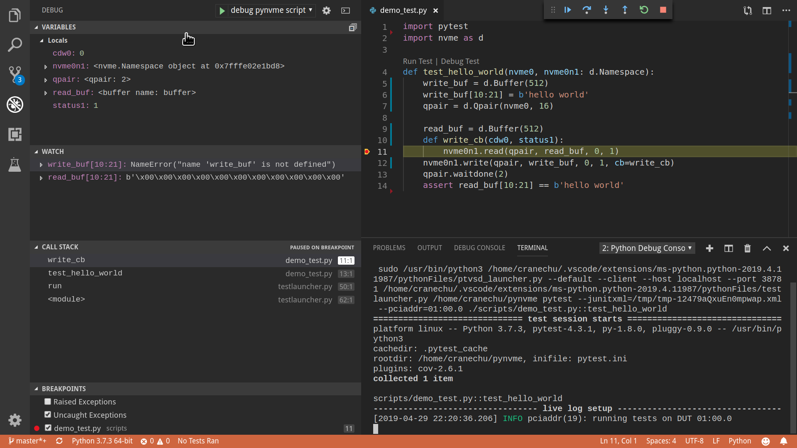
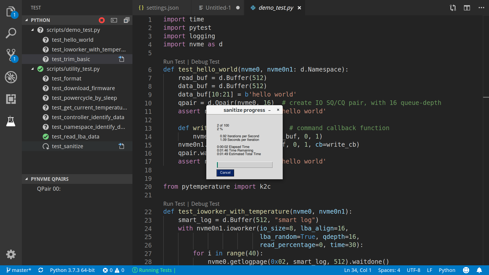
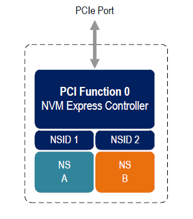
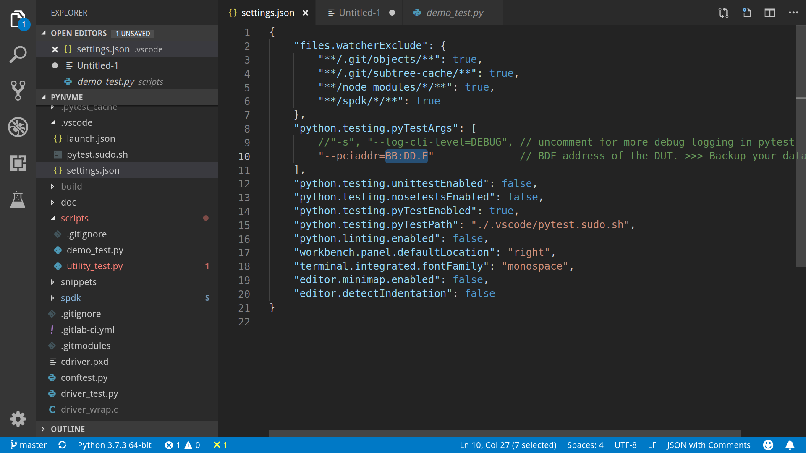
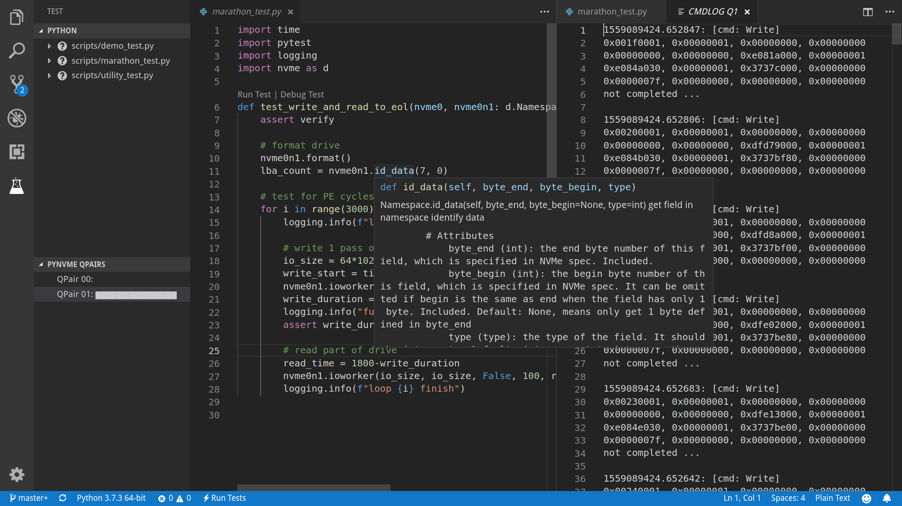
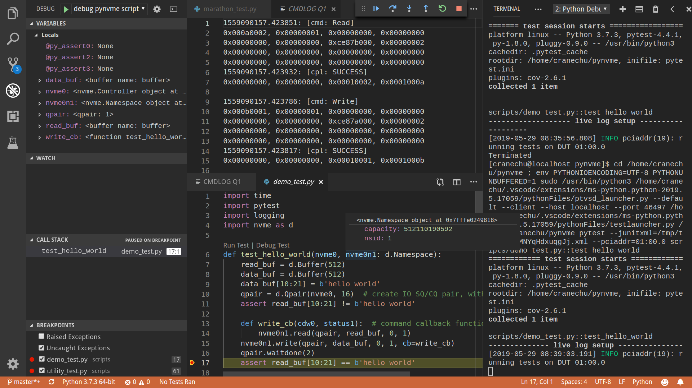

# pynvme介绍与应用

.. toctree::

   test
   
> <div style="text-align: right">有病早治，有问题早解决，大家都好。  
> ——《深入浅出SSD》7.4 回归测试<div>

## 需求

SSD的市场越来越大，国内外进入SSD研发和生产领域的厂商也越来越多。在技术开发方面，大家八仙过海，各显神通。各自通过自己的技术特色，满足各自客户的差异化需求。但是在测试方面，并不是所有团队都有足够的资源和技术积累来做充分的测试，大部分的测试借用了现成的测试软件，由测试工程师手动执行。

这种测试方式会导致一些问题。首先，SSD客户对SSD的理解不断深入，对SSD的需求也在不断调整，导致SSD固件的迭代节奏非常快。每次更新都需要做完整的回归测试，消耗大量的人力、物力和时间资源，甚至有时需要固件开发人员来执行测试，影响了测试结果的客观性。其次，大部分的手动测试都不具备可重复性，更不用说由于测试人员操作习惯的不同而引入的差异了。在这样的情况下，测试不能帮助开发人员直接定位问题，也很难验证一个bugfix是不是真正解决了问题。



如上图所示，在一个项目开发过程中，大部分的bug会在设计和coding阶段引入。越早开始测试，就能越早发现bug，并且解决bug的成本也最低。具体到SSD固件开发的例子，可能在项目初期只能支持顺序读写，那就要开始针对这部分功能开展各种测试，而不是等待随机读写和其他功能的开发。而要实现这个目的，就不能依赖现成的测试软件，一定要开发自己的有针对性的测试程序或者脚本。反过来，当系统测试出现fail,我们尽量在功能测试中通过构造脚本来重现，既能帮助分析问题，也能方便日后回归测试。这样，我们就可以在功能测试阶段尽可能提升固件的质量，减少系统测试阶段的资源开销。Fail early! Fail fast! 从软件工程学的角度讲，我们要从瀑布模型走向敏捷开发。

反观互联网等行业的软件开发，已经接受持续集成和持续发布的实践，有敏捷开发、看板、测试驱动等各种成熟的方法，以及大量自动化的工具。这些都极大地提高软件的开发效率和节奏。当一个bug被引入后，可能几分钟或者几个小时就会被发现，这个时候开发者趁热打铁，解决问题的成本是最低的，同时能阻止bug向主干和其他分支扩散。SSD，特别是SSD的固件，为什么不能像软件那样测试呢？

SSD到测试脚本（或者测试软件）之间，隔着一个驱动程序。所以，一个专门为测试定制的驱动程序可以把固件的测试转化为软件的测试，从而把软件开发的工具和方法引入固件开发的实践中。这个测试驱动需要：

1. 尽可能轻量级，能够把SSD的功能、特性和缺陷完全暴露给上层测试软件。不要引入文件系统、cache等复杂逻辑。这样有助于控制测试驱动的复杂度，提高测试驱动的可靠性，以及测试的全面性。
2. 驱动的接口要简洁，容易操作，降低测试人员的开发成本。最好能用Python等脚本语言来开发脚本。另外，应用层实现的驱动更容易让固件开发和测试工程师上手，降低测试环境部署的难度。
3. IO性能要高，否则无法压出极限使用条件下可能存在的bug。
4. 要能和现代软件开发测试的工具集成，将软件的测试方法和流程引入固件开发，提高测试开发的效率。在最大程度上，用脚本和工具来替代测试的人工执行。

基于这些原因，很多厂家会选择ULink的DriveMaster。但其专有的脚本语法和封闭的工具，以及加密的测试脚本，使得其采购成本、开发成本和执行成本都非常高，甚至是痛苦的。IoL所使用的内核态的dNVMe驱动在性能方面也无法满足要求。

## pynvme

2015年Intel开源了SPDK，为数据中心存储提供一系列软件支持，其中包括了NVMe驱动。SPDK的整体架构非常清晰，NVMe驱动模块的接口完整，实现了大部分NVMe设备的功能。SPDK也经过数据中心的实践检验，有稳定性的保障。但另一方面，SPDK毕竟是以数据中心存储系统为设计目标，会缺少一些SSD测试所需要的功能，譬如：

1. SPDK采用轮询，不支持中断；
2. SPDK只提供C语言的接口，直接在SPDK上面开发测试程序的成本高，并且容易引入bug；
3. 没有提供cmdlog等专门用于测试和调试的功能，测试过程中遇到问题不容易分析；
4. NVMe的SQ和CQ被绑定为1:1的Qpair；
5. 只支持NVMe协议。



但是作为一个Intel的开源项目，SPDK的文档和代码非常规范，模块之间高度解耦。我们以SPDK的NVMe驱动为起点，开发了NVMe设备的测试驱动。这就是pynvme的缘起。

在SPDK的基础上，我们在pynvme中实现了这些功能：

1. 支持MSIx中断：通过软件实现的中断控制器，提供中断相关的测试接口；
2. 通过Cython的封装，为SPDK的NVMe驱动提供了Python接口，抽象出controller, namespace, qpair, buffer, ioworker等对象和方法；
3. 实现了cmdlog：将NVMe测试驱动最近发送的若干条NVMe command及其completion结构记录到cmdlog中；
4. 提供通用化的命令接口，可以发送任何NVMe command，包括VS command，甚至是不符合NVMe协议要求的命令；
5. 结合pytest及其fixture，进一步简化测试脚本的开发和执行；
6. 通过vscode及其插件，在IDE中开发和调试测试脚本，并能查看测试过程中寄存器、Qpair以及cmdlog的数据；
7. 通过S3/standby模式实现SSD设备的电源控制，无需任何额外设备就可以在普通PC上实现部分上下电测试；
9. 实现ioworker，以多进程的方式对同一个SSD设备进行并发读写操作，加大测试压力；
10. 自动计算、记录、校验每个LBA的CRC，实现数据完整性的测试；
11. 自动在每个LBA数据中插入LBA地址等信息，以发现其他数据一致性问题；
12. 可以读写PCI配置空间，以及BAR空间。

pynvme实现了众多NVMe SSD测试所需的功能，并通过Python提供一致的脚本接口。就像美味的煎饼果子，用煎饼包裹各种不同的食材，呈现统一而诱人的风味。pynvme就是专为NVMe SSD测试而生的煎饼大侠！:)


在pynvme中，我们保留了SQ/CQ的Qpair模型，因为这符合实际的使用方式。另外，我们也没有考虑对SATA协议的支持。在整个pynvme开发过程中，我们同步实现对NVMe测试驱动的测试，并在GitLab的CI环境中做到持续测试，以保证pynvme测试驱动的质量。pynvme是一个独立的开源项目，不同的团队可以使用这个测试驱动和框架，甚至共享一部分测试脚本，以提高测试的自动化程度，加快开发的迭代节奏。

## 设计


如上图所示，pynvme在SPDK NVMe驱动的基础上，扩充了一些测试相关的功能，并对外提供Python API接口。

## 脚本示例

pynvme的安装可以参考文档：https://github.com/cranechu/pynvme#install 。下面通过几个例子来展示如何基于pynvme开发NVMe设备的测试脚本。

### Hello world

```python
import pytest
import nvme as d

def test_hello_world(nvme0, nvme0n1:d.Namespace):
    read_buf = d.Buffer(512)
    data_buf = d.Buffer(512)
    data_buf[10:21] = b'hello world'
    qpair = d.Qpair(nvme0, 16) 

    def write_cb(cdw0, status1):
        nvme0n1.read(qpair, read_buf, 0, 1)
    nvme0n1.write(qpair, data_buf, 0, 1, cb=write_cb)
    qpair.waitdone(2)
    assert read_buf[10:21] == b'hello world'
```
SPDK自带了一个hello world示例程序，用了370行C代码。通过pynvme，只需要14行Python代码。下面是具体解释。
```python
import pytest
import nvme as d
```
pynvme推荐在pytest框架下编写测试脚本，所以我们先引入pytest库。这里也引入pynvme的nvme驱动库，我们习惯使用：import nvme as d。
```python
def test_hello_world(nvme0, nvme0n1:d.Namespace):
```
这里定义一个测试函数，pytest定义以test开头的函数为测试函数。这个函数有两个参数，nvme0和nvme0n1，其实是pytest的fixture。当一个测试函数被执行时，pytest首先调用参数列表中定义的fixture，以完成测试的准备工作。pynvme的常用fixture定义在conftest.py中。这里的两个参数会返回待测NVMe设备的controller对象和namespace对象。可以给nvme0n1指定类型d.Namespace，某些编辑器，譬如VSCode，会给我们更多coding辅助。
```python
    read_buf = d.Buffer(512)
    data_buf = d.Buffer(512)
    data_buf[10:21] = b'hello world'
```
这里申请两个buffer，每个buffer有512字节，并且给其中一个buffer填入一些测试字符。
```python
    qpair = d.Qpair(nvme0, 16)
```
为后续读写命令建立一个新的IO Qpair，深度为16。
```python
    def write_cb(cdw0, status1):
        nvme0n1.read(qpair, read_buf, 0, 1)
    nvme0n1.write(qpair, data_buf, 0, 1, cb=write_cb)
    qpair.waitdone(2)
```
通过nvme0n1.write发出一条写命令，将一个buffer的数据写入SSD盘的LBA0。这个命令带有一个回调函数，当命令结束时，会调用这个回调函数。这里的回调函数write_cb里面会继续发出一条读命令，将LBA0的数据读入另一个buffer。这个例子我们会发出2条command。NVMe的命令都是异步发送，所以我们要先等这2条命令结束再做后续处理。
```python
    assert read_buf[10:21] == b'hello world'
```
命令结束后，检查读数据的buffer内容是不是如预期。

我们可以在VSCode中编辑、调试这段脚本。


或者在命令行环境中用如下命令执行这个测试函数：
```shell
make test TESTS=scripts/demo_test.py::test_hello_world
```
测试的log保存在test.log中。在使用pynvme的过程中，如果遇到任何问题，可以在GitHub上[报告问题](https://github.com/cranechu/pynvme/issues/new)，并附上这个test.log文件。也可以通过email联系我们：cranechu@gmail.com。

### Sanitize

```python
def test_sanitize(nvme0, nvme0n1, buf):
    if nvme0.id_data(331, 328) == 0:
        warnings.warn("sanitize operation is not supported")
        return

    logging.info("supported sanitize operation: %d" % nvme0.id_data(331, 328))
    nvme0.sanitize().waitdone()
    
    # sanitize status log page
    nvme0.getlogpage(0x81, buf, 20).waitdone()
    while buf.data(3, 2) & 0x7 != 1:  # sanitize is not completed
        progress = buf.data(1, 0)*100//0xffff
        sg.OneLineProgressMeter('sanitize progress', progress, 100,
                                'progress', orientation='h')
        nvme0.getlogpage(0x81, buf, 20).waitdone()
        time.sleep(1)
```
这个函数启动了一次sanitize，并在GUI中显示sanitize的进度。
``` python
def test_sanitize(nvme0, nvme0n1, buf):
    if nvme0.id_data(331, 328) == 0:
        warnings.warn("sanitize operation is not supported")
        return
```
检查待测设备是否支持sanitize。
``` python
    logging.info("supported sanitize operation: %d" % nvme0.id_data(331, 328))
    nvme0.sanitize().waitdone()
```
启动sanitize，该命令会立刻结束。

``` python
    # sanitize status log page
    nvme0.getlogpage(0x81, buf, 20).waitdone()
    while buf.data(3, 2) & 0x7 != 1:  # sanitize is not completed
        progress = buf.data(1, 0)*100//0xffff
        sg.OneLineProgressMeter('sanitize progress', progress, 100,
                                'progress', orientation='h')
        nvme0.getlogpage(0x81, buf, 20).waitdone()
        time.sleep(1)
```
每秒钟检查一次sanitize的进度，并刷新GUI。运行效果如下图。你可以在scripts/utility_test.py里面找个这个工具以及其他一些SSD日常开发中会用到的工具。



### 一个简单的Trim测试

```python
def test_trim_basic(nvme0: d.Controller, nvme0n1: d.Namespace, verify):
    GB = 1024*1024*1024
    all_zero_databuf = d.Buffer(512)
    trimbuf = d.Buffer(4096)
    q = d.Qpair(nvme0, 32)

    # DUT info
    logging.info("model number: %s" % nvme0.id_data(63, 24, str))
    logging.info("firmware revision: %s" % nvme0.id_data(71, 64, str))

    # write
    logging.info("write data in 10G ~ 20G")
    io_size = 128*1024//512
    start_lba = 10*GB//512
    lba_count = 10*GB//512
    nvme0n1.ioworker(io_size = io_size,
                     lba_align = io_size,
                     lba_random = False, 
                     read_percentage = 0, 
                     lba_start = start_lba,
                     io_count = lba_count//io_size,
                     qdepth = 128).start().close()

    # verify data after write, data should be modified
    with pytest.warns(UserWarning, match="ERROR status: 02/85"):
        nvme0n1.compare(q, all_zero_databuf, start_lba).waitdone()

    # get the empty trim time
    trimbuf.set_dsm_range(0, 0, 0)
    trim_cmd = nvme0n1.dsm(q, trimbuf, 1).waitdone() # first call is longer, due to cache?
    start_time = time.time()
    trim_cmd = nvme0n1.dsm(q, trimbuf, 1).waitdone()
    empty_trim_time = time.time()-start_time

    # the trim time of 10G data
    logging.info("trim the 10G data from LBA 0x%lx" % start_lba)
    trimbuf.set_dsm_range(0, start_lba, lba_count)
    start_time = time.time()
    trim_cmd = nvme0n1.dsm(q, trimbuf, 1).waitdone()
    trim_time = time.time()-start_time-empty_trim_time
    logging.info("trim bandwidth: %0.2fGB/s" % (10/trim_time))

    # verify after trim
    nvme0n1.compare(q, all_zero_databuf, start_lba).waitdone()
```

### pytest的参数化测试

pytest可以参数化测试函数。这个例子中，我们开启不同数目的IOWorker，在不同的进程中对NVMe设备进行读写。

```python
@pytest.mark.parametrize("qcount", [1, 2, 4, 8, 16])
def test_ioworker_iops_multiple_queue(nvme0n1, qcount):
    l = []
    io_total = 0
    for i in range(qcount):
        a = nvme0n1.ioworker(io_size=8, lba_align=8,
                             region_start=0, region_end=256*1024*8, # 1GB space
                             lba_random=False, qdepth=16,
                             read_percentage=100, time=10).start()
        l.append(a)

    for a in l:
        r = a.close()
        io_total += (r.io_count_read+r.io_count_write)

    logging.info("Q %d IOPS: %dK" % (qcount, io_total/10000))
```
更多pytest测试脚本编写的指导，请参考pytest文档：https://docs.pytest.org/en/latest/

更多pynvme的脚本示例，可以参考driver_test.py，以及scripts目录下面的脚本文件。也欢迎您将您的脚本贡献到scripts目录下。

## 安装

pynvme在Linux上通过编译源代码安装，推荐使用Fedora29或CentOS8。首先下载源代码：
```shell
git clone https://github.com/cranechu/pynvme
```
然后编译：
```shell
cd pynvme
./install.sh
```
最终能得到类似*nvme.cpython-37m-x86_64-linux-gnu.so*的二进制库文件，我们称之为nvme驱动库。我们在Python脚本中可以通过import来引入pynvme的驱动库：
```python
import nvme as d
```

## 接口

在Python脚本中引入nvme驱动库之后，就可以开始使用pynvme提供的类和方法了。可以在Python中通过help()查看这些类和方法的docstring文档。使用VSCode编辑时，也可以看到当前类和方法的文档。

### Controller


要操作一个NVMe设备，首先要获取其Controller对象。
```python
import nvme as d
nvme0 = d.Controller(b'01:00.0')
```
创建Controller对象需要用到的参数是该NVMe设备的PCI地址。这个PCI地址可以通过命令lspci获得。请务必获取待测NVMe设备的正确的PCI地址！
```shell
lspci
# 01:00.0 Non-Volatile memory controller: Lite-On Technology Corporation Device 2300 (rev 01)
```
通过下标操作，可以读写待测设备BAR空间里面的NVMe寄存器。
```python
hex(nvme0[0x1c])  # CSTS register, e.g.: '0x1'
```
我们可以向NVMe Controller发送admin命令，譬如：
```python
nvme0.getfeatures(7)
```
NVMe的命令是异步执行的，所以我们要等待命令的完成。
```python
nvme0.waitdone(1)
```
或者使用更简便的写法来发送并回收一条命令：
```python
nvme0.getfeatures(7).waitdone()
```
当命令的返回任何错误状态时，pynvme会抛出warning。如何这个warning是符合期望的，可以通过pytest来捕获：
```python
import warnings

def test_get_identify(nvme0, nvme0n1):
    with pytest.warns(UserWarning, match="ERROR status: 00/0b"):
        nvme0.identify(id_buf, 0, 0).waitdone()
```
如果设备返回命令超时（5秒钟），pynvme也会抛出一个timeout warning。

pynvme支持命令的回调函数。当命令完成时，该回调函数会被执行。在回调函数中，脚本可以得到Completion CDW0以及status字段。回调函数的原型和使用如下所示：

```python
def getfeatures_cb(cdw0, status):
    logging.info(f"get the status: {cdw0}")
nvme0.getfeatures(0x07, cb=getfeatures_cb).waitdone()
```
我们也可以发送identify命令。
```python
buf = d.Buffer(4096, 'controller identify data')
nvme0.identify(buf, 0, 1).waitdone()
logging.info("model number: %s" % buf[24:63, 24])
```
或者通过id_data方法来简化操作：
```python
logging.info("model number: %s" % nvme0.id_data(63, 24, str))
```
pynvme支持NVMe协议规定的大部分命令。除此之外，pynvme还可以发送任意命令，譬如非法命令或VS命令：
```python
nvme0.send_cmd(0xff).waitdone()
```
使用这个通用的send_cmd接口，我们也可以实现更复杂的SQ/CQ creation/deletion测试，等等。

Controller可以被reset，通过写寄存器CC.EN实现。

```python
nvme0.reset()
```
另外，pynvme还在Controller类中提供了一些utility方法，譬如downfw可以将指定的文件作为固件下载到NVMe设备。
```python
nvme0.downfw('path/to/firmware_image_file')
```
上面的reset和downfw方法并不是NVMe命令，所以不需要为他们调用waitdone方法。

NVMe还有一个比较特殊的命令：asynchorous event request (AER)。该命令被发出后，一直等到NVMe设备出现某些错误或者特定事件才会返回。由于无法完全准确预期AER的返回，所以AER由驱动程序在Controller初始化的时候就全部发出，当AER返回时pynvme会产生Warning。如果脚本需要处理AER返回，需要通过aer的fixture来注册回调函数。该回调函数在测试函数执行完毕后会自动注销。AER返回后，驱动程序会自动发出新的AER命令。

```python
def test_sanitize(nvme0, nvme0n1, buf, aer):
    if nvme0.id_data(331, 328) == 0:
        warnings.warn("sanitize operation is not supported")
        return

    def cb(cdw0, status):
        logging.info("aer cb in script: 0x%x, 0x%x" % (cdw0, status))
    aer(cb)
    
    logging.info("supported sanitize operation: %d" % nvme0.id_data(331, 328))
    nvme0.sanitize().waitdone()

    # sanitize status log page
    nvme0.getlogpage(0x81, buf, 20).waitdone()
    while buf.data(3, 2) & 0x7 != 1:  # sanitize is not completed
        progress = buf.data(1, 0)*100//0xffff
        sg.OneLineProgressMeter('sanitize progress', progress, 100,
                                'progress', orientation='h')
        nvme0.getlogpage(0x81, buf, 20).waitdone()
        time.sleep(1)
```
下面是执行该测试的log。可以看到，sanitize结束后触发了AER，并最终调用了脚本注册的AER回调函数。
```shell
cwd: /home/cranechu/pynvme/
cmd: sudo python3 -B -m pytest --color=yes --pciaddr=01:00.0 'scripts/utility_test.py::test_sanitize'

======================================= test session starts =======================================
platform linux -- Python 3.7.3, pytest-4.3.1, py-1.8.0, pluggy-0.9.0 -- /usr/bin/python3
cachedir: .pytest_cache
rootdir: /home/cranechu/pynvme, inifile: pytest.ini
plugins: cov-2.6.1
collected 1 item                                                                                  

scripts/utility_test.py::test_sanitize 
----------------------------------------- live log setup ------------------------------------------
[2019-05-28 22:55:34.394] INFO pciaddr(19): running tests on DUT 01:00.0
------------------------------------------ live log call ------------------------------------------
[2019-05-28 22:55:35.092] INFO test_sanitize(73): supported sanitize operation: 2
[2019-05-28 22:55:35.093] INFO test_sanitize(74): sanitize, option 2
[2019-05-28 22:55:41.288] WARNING test_sanitize(82): AER triggered, dword0: 0x810106
[2019-05-28 22:55:41.289] INFO cb(70): aer cb in script: 0x810106, 0x1
PASSED                                                                                      [100%]
---------------------------------------- live log teardown ----------------------------------------
[2019-05-28 22:55:42.292] INFO script(33): test duration: 7.200 sec


======================================== warnings summary =========================================
scripts/utility_test.py::test_sanitize
  /home/cranechu/pynvme/scripts/utility_test.py:82: UserWarning: AER notification is triggered
    nvme0.getlogpage(0x81, buf, 20).waitdone()

-- Docs: https://docs.pytest.org/en/latest/warnings.html
============================== 1 passed, 1 warnings in 8.28 seconds ===============================
```

### Buffer

pynvme驱动通过DMA方式来和NVMe设备传送数据，所以pynvme需要知道数据buffer的DMA地址，并且保证buffer所在的内存页不会被OS重新映射或换出。SPDK/DPDK提供了此类内存的分配接口，pynvme将其封装为Buffer类。通过创建Buffer对象来分配DMA内存，在参数中指定buffer大小的字节数。通过下标操作，可以访问buffer的数据。
```python
buf = d.Buffer(512)
nvme.identify(buf).waitdone()
# now, the buf contains the identify data
print(buf[0:4])
```

### Qpair

在创建Controller对象的时候，会自动创建admin Qpair，所以我们可以直接通过Controller发送admin命令。但是发送IO命令的IO Qpair，我们则需要显式地创建。
```python
qpair = d.Qpair(nvme0, 10)
```
创建Qpair对象的时候需要提供Controller对象（是的，我们以后会提供对多controller的支持），以及该Qpair的队列深度。pynvme在创建Qpair对象的时候，会自动使能MSIx。脚本可以通过一系列msix_\*方法来控制和检查中断，也可以实现对中断聚合的测试。关于MSIx中断，请参考NVMe和PCIe相关文档。
```python
q = d.Qpair(nvme0, 8)
q.msix_clear()
assert not q.msix_isset()
nvme0n1.read(q, buf, 0, 1)  # we will explain nvme0n1 later
time.sleep(1)
assert q.msix_isset()
q.waitdone()
```
发出IO命令之后，我们也需要调用waitdone来回收这条命令。这时需要调用Qpair对象的waitdone方法。

请注意，IO Qpair上中断的检查不是必须的。pynvme采用轮询的方式检查IO状态，不论有没有检查中断，甚至有没有中断产生，都不会影响waitdone回收已经返回的命令。

对于admin命令，pynvme会在回收命令之前自动检查中断的状态（因为admin queue上的中断不会被聚合）。

### Namespace


NVMe的IO命令必须操作在Namespace之上，所以在发送IO命令之前，我们还需要创建Namespace对象。
```python
nvme0n1 = d.Namespace(nvme0, nsid=1)
```
现在大部分PCIe NVMe SSD都只有一个namespace，测试这样的设备时，可以省略上面的第二个参数。有了Namespace对象和Qpair对象，我们就可以发送IO命令了。
```python
nvme0n1.write(qpair, buf, 0).waitdone()
```
在发送dsm/deallocate (e.g. trim) 命令之前，需要构造的dsm range buffer。
```python
nvme0 = d.Controller(b'01:00.0')
buf = d.Buffer(4096)
qpair = d.Qpair(nvme0, 8)
nvme0n1 = d.Namespace(nvme0)
buf.set_dsm_range(0, 0, 8)
buf.set_dsm_range(1, 8, 64)
nvme0n1.dsm(qpair, buf, 2).waitdone()
```
和admin命令一样，我们也可以发送任意IO命令。
```python
nvme0n1.send_cmd(0xff, qpair, buf, nsid, 1, 2, 3).waitdone()
```
脚本也可以利用这个通用的send_cmd命令来实现fused operations。和admin命令一样，所有IO命令也支持回调函数，以及通过id_data访问namespace的identify数据。

在测试SSD的时候，我们经常需要大量读写NVMe设备，有时也需要做各种performance测试。如果在脚本中发送每一条IO命令，性能肯定非常差。为此，我们在namespace对象中提供了ioworker方法。

### IOWorker

在调用ioworker方法的时候，类似fio，需要提供IO的地址等信息。pynvme会创建新的进程，并在新的进程中创建新的IO Qpair，根据提供的地址信息来发送读写命令。调用ioworker之后，脚本只需要启动并等待ioworker完成指定的读写任务。
```python
r = nvme0n1.ioworker(io_size=8, lba_align=16, lba_random=True, 
                     qdepth=16, read_percentage=0, time=2).start().close()
logging.info(r)
```
上面这个ioworker会创建一个深度为16的Qpair，发送随机地址的写命令。每个IO大小是8个LBA，并且每个IO的起始地址对齐在16个LBA的地方，持续发2秒钟。也可以用with来实现这个ioworker。
```python
def test_ioworker_with_temperature(nvme0, nvme0n1):
    smart_log = d.Buffer(512, "smart log")
    with nvme0n1.ioworker(io_size=8, lba_align=16,
                          lba_random=True, qdepth=16,
                          read_percentage=0, time=30):
        for i in range(40):
            nvme0.getlogpage(0x02, smart_log, 512).waitdone()
            ktemp = smart_log.data(2, 1)
            logging.info("temperature: %0.2f degreeC" % k2c(ktemp))
            time.sleep(1)
```
这个脚本在启动ioworker之后，主进程保持每秒读取一次SMART中的温度值。ioworker会持续30秒钟，主进程会读取40秒钟温度值。用这种方式，可以实现admin命令和IO命令的并发。我们也可以在脚本中同时启动多个ioworker。
```python
    with nvme0n1.ioworker(lba_start=0, io_size=8, lba_align=64,
                          lba_random=False,
                          region_start=0, region_end=1000,
                          read_percentage=0,
                          iops=0, io_count=1000, time=0,
                          qprio=0, qdepth=9), \
        nvme0n1.ioworker(lba_start=1000, io_size=8, lba_align=64,
                         lba_random=False,
                         region_start=0, region_end=1000,
                         read_percentage=0,
                         iops=0, io_count=1000, time=0,
                         qprio=0, qdepth=9), \
        nvme0n1.ioworker(lba_start=8000, io_size=8, lba_align=64,
                         lba_random=False,
                         region_start=0, region_end=1000,
                         read_percentage=0,
                         iops=0, io_count=1000, time=0,
                         qprio=0, qdepth=9), \
        nvme0n1.ioworker(lba_start=8000, io_size=8, lba_align=64,
                         lba_random=False,
                         region_start=0, region_end=1000,
                         read_percentage=0,
                         iops=0, io_count=10, time=0,
                         qprio=0, qdepth=9):
        pass
```
或者用循环的方式创建多个ioworker：
```python
@pytest.mark.parametrize("qcount", [1, 2, 4, 8, 16])
def test_ioworker_iops_multiple_queue(nvme0n1, qcount):
    l = []
    io_total = 0
    for i in range(qcount):
        a = nvme0n1.ioworker(io_size=8, lba_align=8,
                             region_start=0, region_end=256*1024*8, # 1GB space
                             lba_random=False, qdepth=16,
                             read_percentage=100, time=10).start()
        l.append(a)

    for a in l:
        r = a.close()
        io_total += (r.io_count_read+r.io_count_write)

    logging.info("Q %d IOPS: %dK" % (qcount, io_total/10000))
```
同时创建ioworker的数量取决于NVMe设备支持的IO Qpair数量。

通过iops参数，可以控制IOWork发送IO的速度：
```python
def test_ioworker_output_io_per_second(nvme0n1, nvme0):
    nvme0.format(nvme0n1.get_lba_format(512, 0)).waitdone()

    output_io_per_second = []
    nvme0n1.ioworker(io_size=8, lba_align=16,
                     lba_random=True, qdepth=16,
                     read_percentage=0, time=7,
                     iops=1234,
                     output_io_per_second=output_io_per_second).start().close()
    logging.info(output_io_per_second)
    assert len(output_io_per_second) == 7
    assert output_io_per_second[0] != 0
    assert output_io_per_second[-1] >= 1233
    assert output_io_per_second[-1] <= 1235
```
可以看出，pynvme会精确地控制发送IO的数目。

ioworker结束之后，会通过close调用返回一个对象，包括了这些数据：

| 属性           | 类型 | 解释                                                  |
| -------------- | ---- | ----------------------------------------------------- |
| io_count_read  | int  | 该ioworker一共发送的读IO数目                          |
| io_count_write | int  | 该ioworker一共发送的写IO数目                          |
| mseconds       | int  | 该ioworker工作持续的时间，单位毫秒                    |
| latency_max_us | int  | 该ioworker所发送所有IO里面最大的latency时间，单位微秒 |
| error          | int  | 该ioworker结束时的错误码                              |

IOWorker也可以记录并返回每秒实际发送IO的数目，以及所有IO的latency。

### Pcie
pynvme可以访问NVMe设备的PCI配置空间。首先需要获得PCIe对象：
```python
pcie = d.Pcie(nvme0)
```
类似访问Controller的BAR空间，我们通过Pcie对象的下标操作来读写PCI设备的配置空间。
```python
hex(pcie[0：4])  # Byte 0/1/2/3
```
PCIe设备的部分特性定义在配置空间的Capability中。为简化这部分操作，pynvme提供了cap_offset方法，实现Capability的定位。
```python
pm_offset = pcie.cap_offset(1)  # Power Management Capability
```
我们也可以调用reset方法实现对PCIe设备的复位。
```python
pcie.reset()
```

### Subsystem
我们也可以对整个NVMe子系统做复位、掉电通知、上下电等操作。
```python
subsystem = d.Subsystem(nvme0)
subsystem.reset()
subsystem.shutdown_notify(abrupt=True)
subsystem.power_cycle(15)  # power off, delay 15 seconds, and power on
```
pynvme对NVMe设备的上下电操作是通过S3模式实现的。系统进入S3/suspend模式后，NVMe设备会被断电。在指定时间之后，系统会被唤醒，恢复对NVMe设备的供电。
关于S3模式，请参考[Suspend-to-RAM](https://01.org/linuxgraphics/gfx-docs/drm/admin-guide/pm/sleep-states.html#suspend-to-ram)。在使用此项功能之前，请现确认/sys/power/state是否包含mem，/sys/power/mem_sleep是否包含deep：
```shell
~▶ sudo cat /sys/power/state
freeze mem disk
~▶ sudo cat /sys/power/mem_sleep
s2idle [deep]
```
大部分台式机都会默认支持S3。

## pytest
为了更进一步简化脚本编写，我们使用pytest作为pynvme的测试框架。有两个好处：第一，我们只需要将注意力放在测试脚本本身。如何执行测试，执行哪些测试，如何记录log，如何记录测试结果等问题，可以由pytest解决。第二，可以利用pytest的fixture来简化测试脚本的编写。

### 定义测试函数
当执行pytest时，pytest会在当前目录或指定目录下，遍历整个目录树结构。所有文件名以test开头或者结束的文件，都是pytest的测试脚本文件。测试脚本文件里面所有以test开头或者结尾的函数，都是pytest的测试函数。我们也可以用类和方法来组织测试项目，请参考pytest文档。在pynvme中，我们建议通过目录、文件、函数这三层结构来组织所有测试项目。所有测试脚本文件都放在scripts目录及其子目录之下。driver_test.py是用来测试pynvme本身的测试文件，不建议用户直接将其用于SSD测试，毕竟测试的目的不同。测试开发工程师可以参考这里的代码来编写自己的测试脚本。

所有测试文件的开头，都需要import pytest。

### Fixtures

测试函数会带上一些预定义的参数，这些参数在pytest中称为fixture。pynvme在conftest.py里面预定义了一些fixture函数，譬如nvme0，nvm0n1等等。当pytest执行一个测试函数的时候，会先执行参数列表中指定的fixture函数，作为测试项目的初始化过程。另外，fixture也会在测试项目结束后做一些收尾动作。
```python
def test_fixture_example(nvme0, nvme0n1):
    nvme0.getfeatures(7).waitdone()
    qpair = d.Qpair(nvme0, 10)
    buf = d.Buffer(512)
    nvme0n1.read(q, buf, 0, 1).waitdone()
```
在上面的测试函数中，我们可以直接使用nvme0和nvme0n1，他们分别是pynvme预定义的Controller对象和Namespace对象。这样测试脚本的代码会显得更简洁。

### 执行测试
在执行pynvme测试之前，我们需要先初始化运行环境：
```shell
make setup
```
pynvme建议通过make test来执行测试，并在其TESTS参数中指定测试的目录、文件或者函数。
```shell
make test TESTS=scripts
make test TESTS=scripts/demo_test.py
make test TESTS=scripts/utility_test.py::test_download_firmware
```
make test会找到第一个NVMe设备的PCI地址，将其作为待测NVMe设备。对于通常的SSD测试，我们建议OS系统盘放在SATA上面，并且主板上只接一片待测NVMe设备，以免读写错误的SSD导致数据丢失。

### log

通过make test执行测试，测试过程中的log有一部分会直接显示到终端，同时也会记录更多debug信息到文件test.log。当测试出现fail，可以在test.log文件里收集详细的信息。如果需要向pynvme提交bug，请附上完整的test.log文件。

### CI

我们可以在shell的命令行环境下执行测试，指定测试的项目，在标准输出中获取测试结果，以及在test.log获取debug信息。这样我们就可以将测试整合到CI的build配置中，达到自动测试的目的。pynvme本身的测试是在GitLab CI环境中执行的。

我们也可以将固件代码的开发纳入到这个CI流程中。当固件代码仓库有新的提交出现，CI可以在shell中自动获取固件和pynvme的代码，编译固件和pynvme，用pynvme将新的固件下载到NVMe设备，做一次subsystem.power_cycle()以启用新的固件，然后就可以开始执行测试了。这样，我们可以将现代软件开发的流程和工具应用到固件开发。

## VSCode

pynvme让测试开发人员可以方便地写出简洁的测试脚本。但是pynvme还更进一步，让测试开发的过程更舒适。为此，我们推荐VSCode。如果您偏好使用Emacs，可以参考这个[配置](https://github.com/cranechu/.emacs.d/blob/master/init.el)，此处不再赘述。

### 配置

在使用VSCode之前，需要先安装VSCode，并做一些配置动作。

1. 将当前用户加入到visudo中。pynvme操作PCIe设备，很多地方需要root权限。我们通过sudo来获取权限。配过配置visudo，可以避免每次sudo时输入密码。
   ```shell
   sudo visudo
   ```
2. 安装pynvme的vscode插件。
   ```shell
   code --install-extension pynvme-console-1.1.0.vsix
   ```
3. 在.vscode/settings.json文件中，修改待测NVMe设备的PCI地址。
4. 在启动VSCode之前，需要通过make setup来初始化pynvme的运行环境。
   ```shell
   make setup; code .
   ```


### 编辑

VSCode有官方的python插件，可以在编辑python脚本的时候提供一些辅助功能，譬如代码高亮、自动补全、帮助文档等。pynvme的代码包含很多docstring文档，在编辑脚本的时候，VSCode会自动提示相关类和方法的原型和帮助文档。

由于我们在测试函数的参数列表中使用了fixture，VSCode在非运行状态下无法知道这些名字的类型。所以，如果需要在编辑的时候自动获取帮助文档，可以在fixture后面加上python的类型提示。

```python
def test_fixture_with_type(nvme0n1: d.Namespace):
    nvme0n1.ioworker()
```
这样，当键盘输入到ioworker时，VSCode会自动给出ioworker方法的参数列表、默认参数值以及完整的docstring文档。

### 执行测试

首先，对于正式的测试，我们建议在命令行下面通过make test来执行，便于和CI整合。

在VSCode中，我们可以点击目录、文件、函数名右边的三角按钮来执行测试项目。通过点击“虫子”按钮进入debug模式，可以在脚本中添加断点，观察变量、对象的值。pynvme插件可以在VSCode里面显示当前的Qpair，点击某个Qpair，可以显示这个Qpair的cmdlog。这些都能够帮助开发新的测试脚本。



pynvme在scripts/utility_test.py中提供了一些SSD开发和日常使用的GUI工具，譬如格式化、Sanitize、下载新固件、查看identify数据等等。这些工具也可以通过点击三角按钮来启动。


## 总结

pynvme提供了一个Python接口的、功能完整的NVMe驱动程序，方便测试工程师开发SSD测试脚本，帮助SSD固件开发人员排查、验证问题。通过自动化的测试，将软件开发的方法、流程和工具应引入固件开发的实践中。开发团队可以同步开发固件代码和测试代码，以有效控制开发的质量和进度。