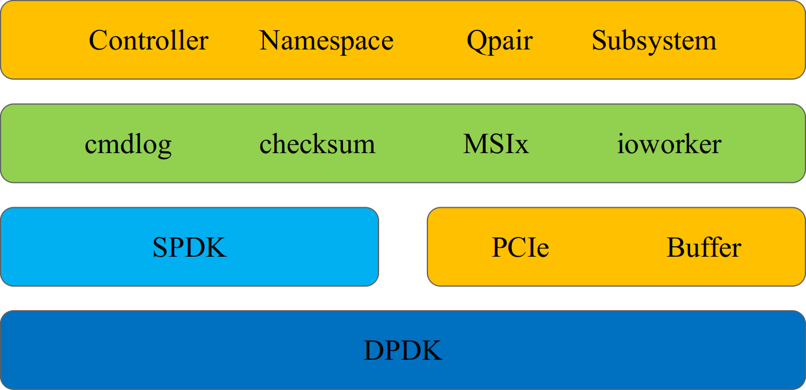

Introduction
============

Background
----------

Storage is important to client computers, data centers and enterprise servers. NVMe is a fast growing standard of storage in the era of Solid State Storage. However, we were still using traditional testing tools which are not designed for NVMe compatibility, performance, reliability and rapid evolution. These tools became the bottleneck of the project. First, most of the existed tools do not provide source code or API, so it is very difficult to be integrited into the automatic test flow, which is critical to Agile project management. Second, many testing tools are developed in HDD/SATA era, so it cannot consistently benchmark the super-fast NVMe SSD. Last but not least, NVMe specification is keeping growing, but the testing tools cannot be changed rapidly. Then, pynvme comes.

Design
------

Pynvme is an user-space PCIe/NVMe test driver with Python API. It is open, fast, and extensible.

Pynvme is an open-source project. So every people and team can use it and make contributions to pynvme. Different from the window-based closed application, pynvme is an open Python module. With pynvme, as well as the whole Python ecosystem, engineers can efficiently develop and deploy their own test scripts.

Pynvme is an user-space software. It bypasses the whole Kernel and accesses PCIe/NVMe hardware resources directly to eliminate system-call overhead. Pynvme is also a poll mode driver (PMD), which further eliminates the cost of interrupts. So its performance is very high and consistent.

Pynvme is extensible. It provides API to access PCIe and physical memory. As the result, scripts can read/write PCIe configuration space, PCIe memory space (aka BAR space), and physical (instead of logical) memory space. With these low-level capabilites, scripts are free to make more innovations.

We did not build pynvme from scratch. We build it based on the `SPDK <https://spdk.io/>`_, a reliable software stack from Intel. We extended SPDK NVMe driver with several testing-purpose functions in pynvme: 

1. Interrupts. SPDK is a polling mode driver, so it does not support interrupts, like MSIx and MSI. We implemented a software interrupt host controller to enable and check interrupt signals.
2. Checksum. Storage cares data integrity. Pynvme verifies each LBA block with CRC32 checksum, without any penalty on performance.
3. Cmdlog. Pynvme traces every command and completion dwords. When any problem happens, users can check the trace data to debug the issue.
4. IOWorker. It is slow to send each IO in test scripts, so pynvme provides an agent to send IOes in separated processes. Users can create multiple IOWorkers with very low resource overhead. 

   
We then wrap all these SPDK and pynvme functions in a Python module. Users can use Python classes (e.g. Controller, Namespace, ...) to test NVMe devices. Here is an identical script as SPDK's 400-line example: https://github.com/spdk/spdk/blob/master/examples/nvme/hello_world/hello_world.c

.. code-block:: python
   :linenos:
                
   import pytest
   import nvme as d

   def test_hello_world(nvme0, nvme0n1):
       # buffer holding read/write data
       read_buf = d.Buffer(512)
       write_buf = d.Buffer(512)
       write_buf[10:21] = b'hello world'
       
       # send write and read command
       qpair = d.Qpair(nvme0, 16)  # create IO SQ/CQ pair, with 16 queue-depth
       def write_cb(cdw0, status1):  # command callback function
           nvme0n1.read(qpair, read_buf, 0, 1)
       nvme0n1.write(qpair, write_buf, 0, 1, cb=write_cb)
   
       # wait commands complete and verify data
       assert read_buf[10:21] != b'hello world'
       qpair.waitdone(2)
       assert read_buf[10:21] == b'hello world'

Now, let's install pynvme.
